# SafeShare ECC: Zero-Trust Secure File Sharing Platform

An industry-grade, zero-trust secure file transfer and encrypted cloud storage prototype utilizing **hybrid cryptography (Asymmetric ECC + Symmetric AES-GCM)**. The application is built as a highly robust Final Year Major Project, proving that a cloud server can store, share, and process files securely **without ever holding plaintext data, private keys, or cleartext logs**.

---

## 🛡️ Core Security Architecture & Cryptography

The platform operates on a absolute **zero-trust model**, enforcing local client-side key generation, secure in-memory data streaming (no intermediate plaintext cached on disk), and **Encrypt-then-Sign** data sealing.

### Cryptographic Primitive Specifications:

| Purpose | Algorithm / Curve | Implementation Details | Security Strengths |
| :--- | :--- | :--- | :--- |
| **Key Exchange (Asymmetric)** | **ECDH (Elliptic Curve Diffie-Hellman)** | Curve **SECP256R1** (NIST P-256) | 128-bit security equivalent, resilient against brute-force |
| **Digital Signatures** | **ECDSA (Elliptic Curve Digital Signature)** | Curve **SECP256R1** + SHA-256 | Immutable sender identity, non-repudiation |
| **Symmetric Encryption** | **AES-256-GCM** | Authenticated Encryption with Associated Data (AEAD) | 256-bit symmetric keys, built-in ciphertext integrity tags |
| **Key Derivation Function** | **HKDF** | HMAC-based Key Derivation (SHA-256) | High-entropy key stretching from ECDH shared secret |
| **Key Sealing at Rest** | **AES-256-GCM (Master Vault)** | Master key loaded from environment (`.env`) | Protects user private keys and database audit logs at rest |

---

## 🔄 Cryptographic Sequence Diagrams

The interactions below show the zero-trust data pipeline.

### 1. Secure Upload & Sealed Envelope Pipeline (Alice to Bob)

During upload, Alice generates an ephemeral key pair, performs ECDH with Bob's public key, derives the AES key via HKDF, encrypts the file bytes to a stream, and signs the ciphertext with her long-term private key.

```mermaid
sequenceDiagram
    autonumber
    actor Alice as Alice (Sender)
    participant Server as FastAPI Server
    participant DB as SQLite DB
    actor Bob as Bob (Recipient)

    Alice->>Server: 1. Request Bob's Public Key
    Server->>DB: Fetch Bob's PEM Public Key
    DB-->>Server: Return Public Key
    Server-->>Alice: Bob's Public Key PEM
    
    rect rgb(15, 23, 42)
        Note over Alice: Client-Side Crypto Envelope Generation
        Alice->>Alice: Generate Ephemeral ECC Keypair (SECP256R1)
        Alice->>Alice: Compute ECDH(Ephemeral Private, Bob Public)
        Alice->>Alice: Derive AES-256 key via HKDF-SHA256
        Alice->>Alice: Encrypt plaintext using AES-256-GCM -> Ciphertext + Tag
        Alice->>Alice: Sign Ciphertext using Alice Private Key (ECDSA)
    end
    
    Alice->>Server: 2. Transmit Secure Payload (Multipart Stream)<br/>[Ciphertext, Ephemeral Public PEM, Signature, Nonce]
    
    rect rgb(13, 20, 35)
        Note over Server: Server Zero-Trust Disk Sealing
        Server->>DB: Save File Record (Nonces, ECDSA Signature, Ephemeral Pub Key, Checksum)
        Server->>Server: Write Ciphertext directly to Disk Vault (uploads/)
    end
    Server-->>Alice: Upload Success (File UUID Created)
```



### 2. Secure Download, Verification & Decryption Pipeline (Bob)

When Bob downloads the file, the server returns the ciphertext and metadata. Bob's node verifies Alice's signature against the ciphertext, computes ECDH to derive the AES key, and decrypts the GCM payload in memory.

```mermaid
sequenceDiagram
    autonumber
    actor Bob as Bob (Recipient)
    participant Server as FastAPI Server
    participant DB as SQLite DB
    actor Alice as Alice (Sender)

    Bob->>Server: 1. Request Download (File UUID) + Send Bearer Token
    Server->>DB: Verify Bob is Authorized Recipient
    DB-->>Server: Return File Metadata (ECDSA Signature, Ephemeral Pub Key, Nonces)
    Server->>Server: Read Ciphertext from Vault on Disk
    
    rect rgb(15, 23, 42)
        Note over Server: Server-Side Zero-Trust Decryption & Verification
        Server->>Server: Verify ECDSA Signature of Ciphertext using Alice Public Key
        alt Signature Verification FAILED (Forgeries / Modifications)
            Server->>DB: Log CRITICAL 'SIGNATURE_FORGERY' Security Event
            Server-->>Bob: HTTP 400 Bad Request: Signature altered!
        else Signature OK
            Server->>Server: Decrypt Alice Private Key using Master Key
            Server->>Server: Perform ECDH(Bob Private Key, Ephemeral Public Key)
            Server->>Server: Derive AES-256 key via HKDF-SHA256
            Server->>Server: Decrypt ciphertext using AES-256-GCM
            alt GCM Tag Decryption FAILED (Tampering)
                Server->>DB: Log CRITICAL 'TAMPERING_ATTEMPT' Security Event
                Server-->>Bob: HTTP 400 Bad Request: AEAD Tag Mismatch!
            else Decryption SUCCESS
                Server->>DB: Log AUDIT 'DOWNLOAD' Transaction
                Server-->>Bob: Stream decrypted plaintext back to browser
            end
        end
    end
```



---

## 📁 Repository Directory Structure

```
.
├── crypto_core/             # Ground-truth cryptographic core modules
│   ├── ecc.py               # Asymmetric ECC SECP256R1 generators
│   ├── encryption.py        # AES-256-GCM encryption/decryption routines
│   ├── key_derivation.py    # ECDH secrets & HKDF-SHA256 derivation
│   └── signature.py         # ECDSA digital signing and verification
├── backend/                 # FastAPI backend application
│   ├── database/            # SQLAlchemy database engine and models
│   │   ├── models.py        # SQLite database schema (Users, Files, Logs)
│   │   └── session.py       # DB Connection pooling and sessions
│   ├── routes/              # FastAPI Router controllers
│   │   ├── auth.py          # Onboarding, bcrypt hashing, JWT emission
│   │   ├── files.py         # In-memory uploads, downloads, revocation
│   │   ├── users.py         # Recipient selection directory lookup
│   │   └── security.py      # Sealed audit feed, AI insights, Sandbox
│   ├── services/            # Cryptographic service layer wrapping crypto_core
│   │   └── crypto_service.py # AES private key rest sealing & ECDH pipelines
│   ├── main.py              # Application entrypoint & CORS configurations
│   ├── config.py            # Master path structures and environment fallbacks
│   └── Dockerfile           # Python production container configuration
├── frontend/                # React Vite Frontend SPA
│   ├── src/                 # React UI Components and Pages
│   │   ├── components/      # UI components (TerminalLogs console shell)
│   │   ├── pages/           # Screen modules (Auth, Dashboard)
│   │   ├── App.jsx          # Root session manager and router
│   │   ├── index.css        # Custom CSS system (Tailwind v4 styling system)
│   │   └── main.jsx         # App bootstrapping
│   ├── vite.config.js       # Vite configuration with tailwind & API proxy
│   ├── nginx.conf           # Static server configuration for Nginx
│   └── Dockerfile           # Multi-stage production building Dockerfile
├── tests/                   # Automated security test modules
│   └── test_security.py     # Resiliency assertion test suites (pytest)
├── docker-compose.yml       # Production orchestration stack
└── requirements.txt         # Backend virtual environment packages list
```

---

## ⚡ Quickstart Deployment

### Method A: One-Click Production Deployment (Docker Compose)
This deploys the entire ecosystem (Nginx Frontend + FastAPI Backend) fully connected with named persistent volumes on your local machine.

1. Ensure **Docker Desktop** is running.
2. In the root directory, execute:
   ```bash
   docker-compose up --build
   ```
3. Open your browser and navigate to:
   - **Frontend Dashboard**: [http://localhost](http://localhost)
   - **Interactive API Documentation**: [http://localhost:8000/docs](http://localhost:8000/docs)

---

### Method B: Local Developer Mode (Manual Setup)

#### 1. Bootstrap FastAPI Backend
1. Initialize python virtual environment and activate it:
   ```bash
   python3 -m venv venv
   source venv/bin/activate
   ```
2. Install backend dependencies:
   ```bash
   pip install -r backend/requirements.txt
   pip install httpx
   ```
3. Start the FastAPI development server:
   ```bash
   python -m uvicorn backend.main:app --port 8000 --reload
   ```

#### 2. Bootstrap React Frontend
1. Open a new terminal window, navigate to `frontend/`:
   ```bash
   cd frontend
   npm install
   ```
2. Launch Vite development compiler:
   ```bash
   npm run dev
   ```
3. Open the printed localhost address (typically [http://localhost:5173](http://localhost:5173)).

---

## 🧪 Automated Security Test Execution

To execute our highly rigorous cybersecurity assertions (RBAC integrity, GCM tag corruption, ECDSA forgery):

1. Activate your virtual environment and run the pytest testing command:
   ```bash
   PYTHONPATH=. ./venv/bin/pytest tests/test_security.py -v
   ```
2. Verify that all 5 critical security parameters report a green `PASSED` status:
   - `test_auth_registration_and_login`
   - `test_secure_file_upload_and_download`
   - `test_tampering_attack_detection`
   - `test_signature_forgery_detection`
   - `test_unauthorized_access_control`

---

## 🎮 Viva Presentation Walkthrough (Attack Sandbox)

When demonstrating the platform to examiners during the final defense, follow these steps to prove the system's absolute resilience under active attacks:

1. **Onboard Identities**: Register two separate users (`alice` and `bob`).
2. **Secure Transfer**: Log in as `alice` and upload a file named `viva_test.txt` designated for recipient `bob`.
3. **Verify Integrity**: Log in as `bob`, locate `viva_test.txt` in your inbox, and click **Download**. Check the browser console or the terminal logs panel at the bottom to see:
   - `[SUCCESS] ECDSA Digital Signature Verified.`
   - `[SUCCESS] AES-GCM authenticated tag verification SUCCESS.`
4. **Simulate Ciphertext Tampering (MitM)**:
   - Navigate to the **Attack Simulator** tab.
   - Click **Corrupt Ciphertext** next to `viva_test.txt`. (This edits the 15th byte of Alice's encrypted file on the server's disk, simulating packet interception).
   - Go back to the **Cryptographic Vault** tab and attempt to download.
   - **Observed Result**: The download is blocked, and an alert triggers showing: `SECURITY QUARANTINE: Cryptographic integrity check failed!`. The terminal console logs an immediate `SIGNATURE_FORGERY` or `TAMPERING_ATTEMPT` warning.
5. **Simulate Signature Forgery**:
   - Navigate back to the **Attack Simulator** tab.
   - Click **Forge Signature** next to `viva_test.txt`. (This writes random hex into Bob's DB signature column, simulating a database breach where the attacker swaps files and attempts signature bypass).
   - Attempt to download.
   - **Observed Result**: The download is blocked instantly, raising an alarm before AEAD decryption even initializes!
6. **System Self-Repair**:
   - Go to the sandbox, click **Repair File** (restoring signature and ciphertext backups).
   - Bob can now successfully download the decrypted plaintext again, showcasing the fault tolerance of our secure platform!
